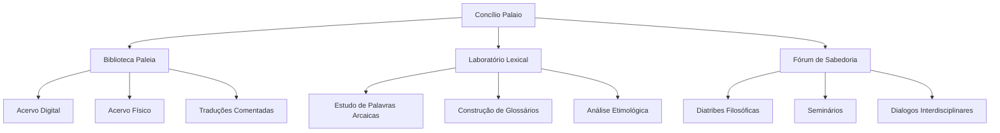

# Concílio Palaio

<div align="center">


**Um manifesto lexical pela Polyograph – Deep Polymath & Polyglot Hub**

</div>

## 🌟 Visão Geral

O **Concílio Palaio** é um espaço intelectual e cultural dedicado à celebração, investigação e perpetuação de um ecossistema temático transversal e multidisciplinar. Este projeto ancora-se em dois pilares fundamentais:

- **O amor pelas palavras e livros** em suas manifestações mais antigas
- **A busca pela sabedoria** que emerge dessas fontes ancestrais

Através de uma abordagem que combina tradição e inovação, articulamos quatro dimensões conceituais expressas através de neologismos que refletem a riqueza de nossas aspirações intelectuais.

## 📚 Neologismos Fundamentais

| Termo | Definição | Domínio |
|-------|-----------|---------|
| **Paleobibliofilia** | A paixão pelos livros antigos e tradições literárias ancestrais que moldaram os alicerces civilizatórios | Bibliográfico |
| **Paleolexicofilia** | O amor pelos léxicos antigos, palavras esquecidas e idiomas que sustentaram narrativas humanas | Linguístico |
| **Paleobibliosofia** | A reflexão filosófica sobre textos antigos como fonte de sabedoria, ética e compreensão histórica | Filosófico |
| **Paleolexicosofia** | A investigação da sofisticação de palavras arcaicas em contextos éticos, metafísicos e culturais | Hermenêutico |

## 🏛️ Inspirações Intelectuais

O Concílio Palaio encontra suas raízes em tradições intelectuais diversas:

- **Povos do Livro** (Judaísmo, Cristianismo, Islamismo) e suas tradições escritas
- **Literatura Talmúdica e Corânica** com suas reflexões profundas sobre textos sagrados
- **Patrística** e o legado teológico-filosófico dos Padres da Igreja
- **Teosofia** na busca por sabedoria divina em textos sagrados
- **Paleografia e Paleolinguística** no estudo de manuscritos e línguas ancestrais

## 🎯 Objetivos

### Principais
- **Preservação e Estudo** de textos e léxicos antigos
- **Divulgação e Educação** através de recursos acessíveis
- **Interdisciplinaridade** entre áreas do conhecimento
- **Construção de Comunidade** de estudiosos e entusiastas

### Secundários
- Digitalização de manuscritos raros
- Produção de traduções comentadas
- Organização de fóruns de discussão
- Publicação de pesquisas acadêmicas

## 🏗️ Estrutura do Projeto

### Núcleos Temáticos


### Atividades Regulares
- **Cursos** (introdutórios e avançados)
- **Workshops** de paleografia
- **Clubes de Leitura**
- **Publicações periódicas** (*Anais do Concílio Palaio*)

### Eventos Anuais
1. **Conferência do Concílio Palaio** (encontro anual)
2. **Exposição Itinerante** de manuscritos
3. **Maratona de Tradução** colaborativa

## 🚀 Como Contribuir

### Para Estudantes e Pesquisadores
1. Participe dos nossos fóruns de discussão
2. Submeta artigos para os *Anais*
3. Contribua com traduções ou transcrições

### Para Desenvolvedores
```bash
# Clone o repositório
git clone https://github.com/polyograph/concilio-palaio.git

# Instale dependências (se aplicável)
npm install

# Execute localmente
npm start
```

### Diretrizes de Contribuição
- Respeite a natureza acadêmica do projeto
- Mantenha tom reverente em relação às fontes ancestrais
- Cite referências adequadamente
- Participe construtivamente das discussões

## 📖 Recursos Disponíveis

### Digitais
- **Biblioteca Digital** com manuscritos digitalizados
- **Glossário Interativo** de termos arcaicos
- **Banco de Dados** de referências bibliográficas
- **Canal no YouTube** com palestras e aulas

### Físicos (São Paulo)
- **Acervo físico** disponível para consulta agendada
- **Espaço de estudo** para pesquisadores
- **Coleção de fac-símiles** de manuscritos importantes

## 👥 Comunidade

### Redes e Plataformas
- **Site Oficial**: [polyograph.renderforestsites.com](https://polyograph.renderforestsites.com/)
- **GitHub**: [github.com/polyograph](https://github.com/polyograph)
- **Medium**: [@polyographbr](https://medium.com/@polyographbr)
- **Substack**: [substack.com/@polyographdeeppolyglothub](https://substack.com/@polyographdeeppolyglothub)
- **YouTube**: [@PolyographDeepPolyglotHub](https://www.youtube.com/@PolyographDeepPolyglotHub)

### Encontros Presenciais
- Reuniões mensais em São Paulo
- Grupos de estudo temáticos
- Oficinas práticas de paleografia

## 📜 Licença

Este projeto está licenciado sob a **Creative Commons Attribution-NonCommercial-ShareAlike 4.0 International License**.

Você pode:
- Compartilhar e adaptar o material
- Usar para fins não comerciais
- Distribuir suas contribuições sob mesma licença

**Restrições**:
- Uso comercial requer permissão específica
- Atribuição obrigatória aos autores originais

## 📞 Contato

**Guilherme Gonçalves Machado**  
Fundador e Curador do Concílio Palaio  
São Paulo, Brasil

**Redes Sociais**:
- Twitter/X: [@polyographbr](https://x.com/polyographbr)
- Facebook: [Polyograph](https://www.facebook.com/Polyograph/)
- Email: polyographbr@gmail.com

---

<div align="center">

*"A sabedoria não é produto do tempo, mas da profundidade do olhar sobre o tempo."*

**— Concílio Palaio**

</div>
